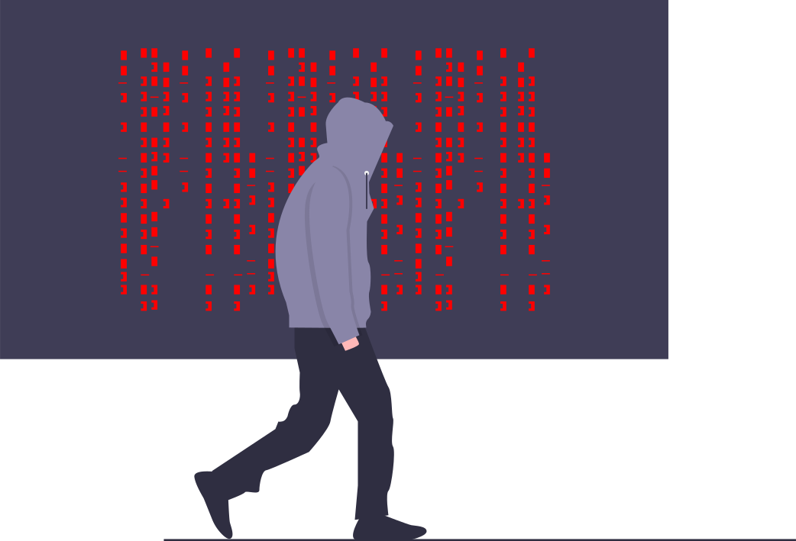

Component Library

Perseus's Component Library
===========================

I am attending neog.camp and I want to make a library which would make all my projects look good and consistent.

* * *

@Typography
-----------

This is the Largest Heading.
============================

This is the Second Largest Heading.
-----------------------------------

### This is the Third Largest Heading.

#### This is the Third Smallest Heading.

##### This is the Second Smallest Heading.

###### This is the Smallest Heading.

Normal Text. This is free flowing and it'll wrap at the end like a paragraph.

This is a relatively smaller text.

* * *

@Container
----------

### Fluid Container

This is a fluid container and it'll go till the end of the page.

### Center Container

This is a fluid centered container and it'll go till the specified width.

* * *

@Links
------

[PRIMARY LINK](https://www.youtube.com/watch?v=dQw4w9WgXcQ) [SECONDARY LINK](https://www.youtube.com/watch?v=dQw4w9WgXcQ)

* * *

@Lists
------

### Unordered List

*   Item One
*   Item Two
*   Item Three
*   Item Four
*   Item Five

### Unordered In-Line List

*   In-Line Item One
*   In-Line Item Two
*   In-Line Item Three
*   In-Line Item Four
*   In-Line Item Five

### Reverse Ordered List

1.  Item One
2.  Item Two
3.  Item Three
4.  Item Four
5.  Item Five

* * *

@Nav
----

PerseusX99007

*   [HOME](https://www.youtube.com/watch?v=dQw4w9WgXcQ)
*   [PROJECTS](https://www.youtube.com/watch?v=dQw4w9WgXcQ)
*   [ABOUT](https://www.youtube.com/watch?v=dQw4w9WgXcQ)

* * *

Header
------

@Heading inside Hero
====================

* * *

@Sections
---------

### White Section

This will have white background.

### Off-White Section

This will have grey background.

* * *

@Footer
-------

Some small heading inside footer.

*   Social One.
*   Social Two.
*   Social Three.
*   Social Four.
*   Social Five.